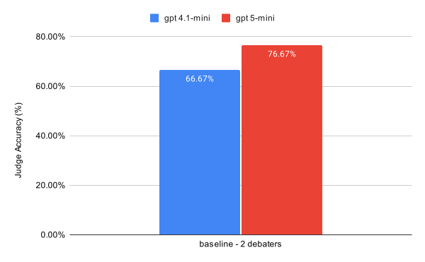
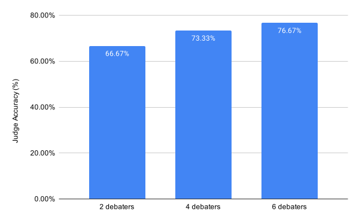
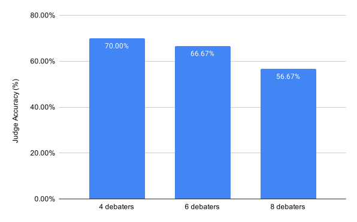

# Debate with Sandbagging: A Minimal Extension of “More Persuasive LLM Debaters → More Truthful Answers”

**One-line**: Replicated the debate-improves-truth result; extended to N > 2 debaters with sandbagging roles. Judge accuracy improves with more debaters, but decreases when N − 1 debaters on the correct-answer team are sandbagging.

**Why this matters**  
Tests whether debate-style oversight can be subverted by strategic underperformance (sandbagging). Directly relevant to oversight-subversion benchmarks and collusion-style risks in automated regimes.

## TL;DR
- **Replication**: [Debating with More Persuasive LLMs Leads to More Truthful Answers](https://arxiv.org/pdf/2402.06782).  
- **Extension**: N-debaters + assigned sandbagger(s); measured effects on judge truth rate.
- **Findings**:
  - Replication: More Persuasive LLM Debaters → More Truthful Answers
  - Judge Accuracy Improves With More Debaters 
  - Sandbagging Hurts The Debate
- **Limitation**: Small scale (15 QuALITY questions, single run).

## Setup
- **Models**: gpt-4.1-mini and gpt-5-mini as debaters.
- **Data**: Sample of 15 QuALITY questions, from the same dataset used in the original paper.
- **Debate Protocol**:
  - **rounds**=3
  - **judge**=gpt-4.1-mini
  - **N debaters**=If there are more than two debaters (N > 2), they are divided into teams and alternate between rounds.
- **Sandbagging Assignment**: when sandbagged was assigned, N-1 debaters of the team arguing for the correct position were sandbagged. [Sandbag prompt](https://github.com/renan-cunha/llm_debate/blob/main/sandbag_prompt.txt)
  -  [AI Sandbagging: Language Models can Strategically Underperform on Evaluations](https://arxiv.org/abs/2406.07358)).
- **Metrics**: judge-truth%,

## Key Results

### Replication: More Persuasive LLM Debates → More Truthful Answers



Using a stronger debater model (GPT-5-mini vs. GPT-4.1-mini) led to higher judge accuracy.

### Judge Accuracy Improves With More Debaters



Increasing the number of debaters (equivalent to the number of rounds) leads to higher judge accuracy.
This finding differs from the original paper, where accuracy was found to remain stable or even decrease.
One possible explanation for this difference is the fact that GPT-4.1-mini, which was used as the judge, handles larger contexts more effectively.


### Sandbagging Hurts The Debate



Sandbagging decreases judge accuracy. Even when there is still one legitimate debater arguing for the correct answer, they lose ground as the number of sandbagging debaters on their team increases. This showcases the need to address sandbagging (and other potential collusion strategies) in debate and other automated oversight frameworks.

* [A few debate transcripts](https://github.com/renan-cunha/llm_debate/blob/main/transcripts)

## Run
```bash
# create virtual env
pip install -r requirements.txt
export API_KEY=...   # set openai key
bash run_debate.sh \
  --model_name=gpt-5-mini-2025-08-07 \
  --exp_dir=./exp/gpt5_run \
  --sandbag \
  --num_debaters=4
```

***

This was my final project at the [ML4Good Bootcamp](https://www.ml4good.org/). Huge thanks to Alejandro Acelas, Carol Erthal, and Elvis Sikora for their helpful feedback!